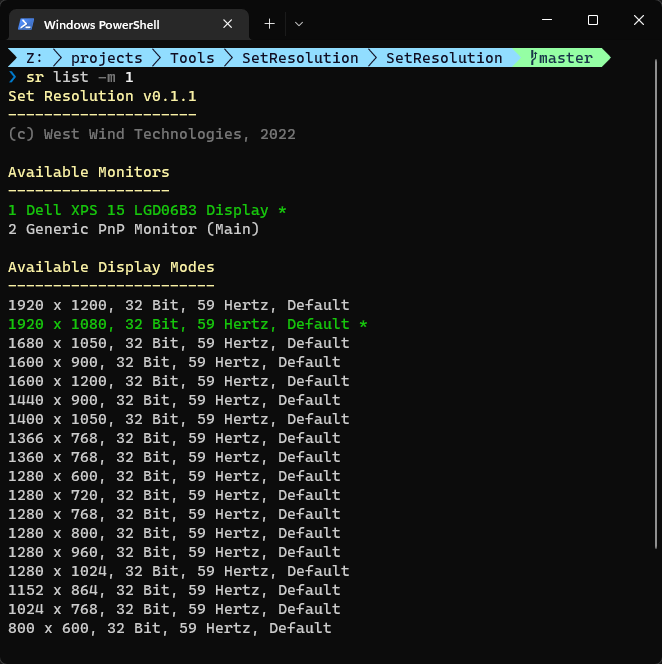

# Set Windows Display Resolution from Command Line

This small command line utility allows you to quickly set Windows Display Resolutions to any of the available display modes available for your active Monitors or virtual display devices. It allows you to:

* Set an explicit Display Resolution
* List all available Display Modes and Monitors
* Create and use Display Mode Profiles for quick access

> **Warning:** Use at your own risk. Setting an invalid display mode can [leave your screen inaccessible](#fark-i-set-a-resolution-that-doesnt-work-now-what). Use only with supported display modes. We check your settings against available modes and only allow those that match a driver display mode, but there may still be some modes that don't work with your monitor.
  
## Basic Usage
Most common usage is via a pre-defined profile name:

```powershell
# Set to a profile named 1080 on default monitor
SetResolution 1080

# or shortcut version (sr.exe) on Monitor 2
sr 4k -m2 
```

Alternately you can explicitly pick a resolution, frequency, bit rate and Orientation:

```powershell
sr SET -w 2560 -h 1600 -f 60 -b 32 -o 0 
```
*Frequency, BitRate and Orientation are optional*

To see recommended resolutions for a specific monitor:

```powershell
# default list is filtered to current frequency/bitrate/orientation
sr LIST -m1

# all resolutions
sr LIST -m1 -la
```

To create a new profile:

```powershell
sr CREATEPROFILE -w 2560 -h 1600 -f 60 -b 32 -o 0 
```

## Installation
You can install this tool in a couple of ways (for now).

### Download Single-File EXE Binary
This tool is a small, self-contained Console EXE application. For now, you can download the `SetResolution.exe` (or `sr.exe` file directly from here):

[Download SetResolution.exe](https://github.com/RickStrahl/SetResolution/raw/master/Binaries/SetResolution.exe)

I recommend you copy to a folder location that is in your Windows path or add it to your path, so you can run `SetResolution` from any location.

### Install as Dotnet Tool (.NET 6.0 SDK required)
For .NET developers the easiest way to install and keep the tool up to date is via Dotnet Tool installation. This requires that the [.NET 6.0 (or later) SDK](https://dotnet.microsoft.com/en-us/download).

You can install, update and use it with:

```powershell
# install
dotnet tool install -g SetResolution

# Use it
SetResolution 1080 -m2

#update
dotnet tool update -g SetResolution
```

### Full Syntax
To show available syntax, run `SetResolution.exe` or `sr.exe` without any parameters or `/?` or `HELP`. 
The help information is as follows:

```text
Syntax:
-------
SetResolution  [<ProfileName>|SET|LIST|PROFILES|CREATEPROFILE]
               -w 1920 -h 1080 -f 60 -b 32 -o 0 -p ProfileName

Commands:
---------
HELP || /?          This help display
<ProfileName>       Run with only a Profile Name sets that display profile
SET                 Sets Display Settings -
                    provide either a profile (-p) or display options -w/-h/-f/-b/-o
LIST                Lists all available display modes and monitors
PROFILES            Lists all saved profiles (stored in SetResolution.xml)
CREATEPROFILE       Creates a new profile by specifying name and display options

Display Settings:
-----------------
-w                  Display Width
-h                  Display Height
-f                  Display Frequency in Hertz (60*)
-o                  Orientation - 0 (default*), 1 (90deg), 2 (180deg), 3 (270deg)
-p                  Profile name

Command Modifiers
-----------------
-m                  Monitor Id  to apply command to (1,2,3 etc - use LIST to see Ids)
                    applies to: LIST, SET. If not specified, Default monitor is used.
-la                 List all Display modes (LIST command). Default only shows current matches

Examples:
---------
SetResolution MyProfile
SetResolution SET -p MyProfile -m2
SetResolution SET -w 1920 -h 1080 -f 60 -m2
SetResolution LIST -m2
SetResolution PROFILES
SetResolution CREATEPROFILE -p "My Profile" -w 1920 -h 1080 -f 60
```
## Multi-Monitor Support
This tool supports multiple monitors via the `-m <MonitorNumber>` command line switch. By default the **Main Windows Monitor** monitor is used which corresponds to the **Main Monitor** setting configured in the Windows Display settings.

Both the `SET` and `LIST` command support the `-m` switch to specify the monitor that the command applies to. Profile operations do not specify a monitor.

The `-m` switch uses a numbering scheme from 1-n, with monitor numbers identified in the `LIST` command. The numbers also reflect the same value you see in the Windows Display Settings dialog.

## List Available Monitors and Display Modes
You can use the `LIST` command to show available Monitors and Display Modes as well as the currently selected monitor and display mode. The display modes available are specific for the Monitor/Video Driver combination that is active.

If you don't specify the `-m` switch which selects a monitor, the **Windows Main Monitor** is used. The list of Display Modes is always specific to the selected monitor. You can explicitly select a monitor via the `-m` switch. 

The selected monitor and display mode are highlighted in the list (green and *).



```powershell
sr LIST -m1
```
This shows a list of display modes available. By default the list only shows:

* Sizes with the Width > 800 pixels
* Frequencies that match the current display frequency
* Orientation that match the current orientation

This list is similar to the list you see in the Windows Display Resolution drop down list.

If you want to see `all display modes` available for your monitor/video driver combination use the `-la` command line switch:

```powershell
sr LIST -m1 -la
```

The list displays the selected monitor and display mode for this command in green and with the `*` at the end.

This displays all displays modes for all sizes, orientations and frequencies. This list tends to very large with many duplicate and overlapping values. However it can be useful to match an exact display mode.

Use these display modes when you create new Profiles and ensure your Profile matches the Display Modes that are supported.

## Profiles
Profiles are the preferred way to switch resolutions as they give you quick access via a single profile name string, instead of having to specify all the settings individually.

Profiles values stored are:

* Height and Width
* Monitor Frequency (60)
* Color Bit Size  (32)
* Orientation (0)

<small>*values in parenthesis are optional default values if not specified*</small>

> ##### Profiles do not store Monitor numbers
> If you need to apply to a specific monitor make sure you add the `-m` switch to explicit specify the specific monitor you want to apply the profile to.

Profiles are 'shortcuts' to a specific set of Display Settings with a name. You can quickly access a profile with:

### Create a new Profile
You can create a profile with:

```powershell
SetResolution CREATEPROFILE -p <profileName> -w 1280 -h 768 -f 59
```
#### Manually Edit SetResolution.xml
Profiles are stored in `SetResolution.xml` in the same folder as the .exe and you can manually edit the XML file to add new profiles. In order to remove profiles you can edit the `SetResolution.xml` file.

```xml
<?xml version="1.0" encoding="utf-8"?>
<AppConfiguration xmlns:xsd="http://www.w3.org/2001/XMLSchema" xmlns:xsi="http://www.w3.org/2001/XMLSchema-instance">
   <Profiles>
      <DisplayProfile>
         <Name>1080</Name>
         <Width>1920</Width>
         <Height>1080</Height>
         <Frequency>60</Frequency>
         <BitSize>32</BitSize>
         <Orientation>Default</Orientation>
      </DisplayProfile>
      <DisplayProfile>
         <Name>4k</Name>
         <Width>3840</Width>
         <Height>2160</Height>
         <Frequency>60</Frequency>
         <BitSize>32</BitSize>
         <Orientation>Default</Orientation>
      </DisplayProfile>
      <DisplayProfile>
         <Name>1440</Name>
         <Width>2560</Width>
         <Height>1440</Height>
         <Frequency>60</Frequency>
         <BitSize>32</BitSize>
         <Orientation>Default</Orientation>
      </DisplayProfile>
      <DisplayProfile>
         <Name>720</Name>
         <Width>1280</Width>
         <Height>720</Height>
         <Frequency>60</Frequency>
         <BitSize>32</BitSize>
         <Orientation>Default</Orientation>
      </DisplayProfile>
   </Profiles>
</AppConfiguration>
```

> Yeah I know XML. But to keep out any external dependencies, XML serialization is used here :smile:

### Setting a Profile
Once a profile has been created you can invoke it.

```powershell
# Shortcut way - on monitor 2
SetResolution <profileName> -m2

# Full syntax - on main monitor (not specified)
SetResolution SET -p <profileName> 
```


### Default Profiles
A number of default profiles are added for common 16:9 resolutions @ 60hz which is most common:

```text
Available Profiles
------------------
1080:  1920 x 1080, 32, 60
4k:  3840 x 2160, 32, 60
1440:  2560 x 1440, 32, 60
720:  1280 x 720, 32, 60
```

These are loaded on first load of the application and stored in the saved profile file (if writable).

### Profiles File Location: SetResolution.xml
Profiles are stored on disk in `SetResolution.xml` in the same folder as the `.exe` and you can add and remove additional profiles there or add via the `CREATEPROFILE` action as described above.

> **Note:** If you installed the EXE in a location that has no write access, saving of new Profile entries with `CREATEPROFILE` will fail silently. Either give `SetResolution.xml` read/write access or move the application to a location where you are allowed to write files.


## Fark: I set a Resolution that doesn't work. Now what?
If you accidentally set your monitor into a display mode that isn't supported or just doesn't work with your monitor, it's possible that your screen becomes inaccessible. Because this tool switches the default display settings, once a wrong setting is made the screen simply will be blank and it's not just a simple matter of rebooting as the setting is applied to the Windows settings and persists on a reboot.

To reset a non-working display setting you have to **boot into Windows Safe Mode** and select another display mode, then reboot. 

Note: It's difficult to select an invalid display mode. We set the display mode only to modes that are available for the current display, so setting a non-supported resolution should in theory never happen. However, you can end up with a resolution that your driver supports but that your monitor does not. This mostly involves unsupported frequencies.

> Moral of the Story: Pick a display mode that you know works using common, widely used resolutions. If not sure try the settings in the Windows Resolution box first.

## Credits
Most of the hard work of this tool is in the Win32 interfaces to retrieve and set display settings. All of that code is based on this excellent article on C# Corner by [Mohammad Elseheimy](https://www.c-sharpcorner.com/members/mohammad-elsheimy):

* [Changing Display Settings Programmatically
](https://www.c-sharpcorner.com/uploadfile/GemingLeader/changing-display-settings-programmatically/)

## To do

* Add support for configuration of non-default monitor(S)

